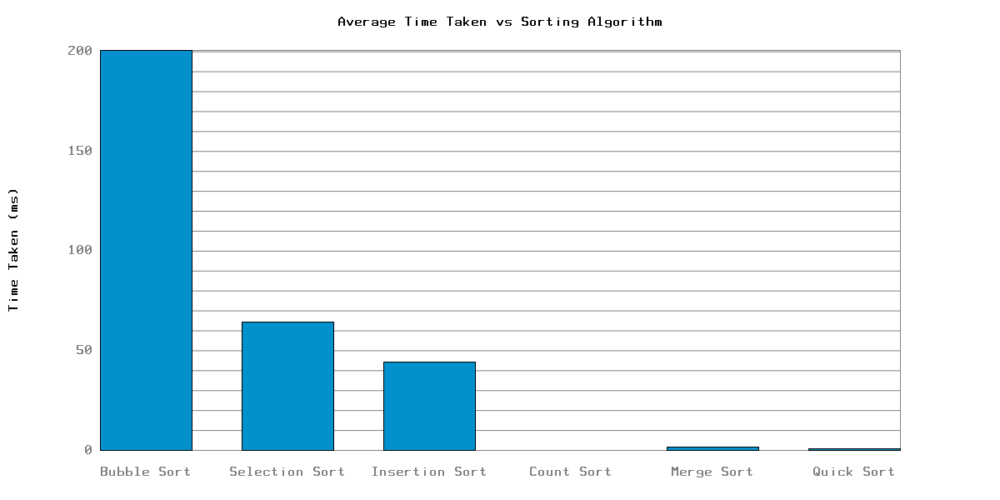
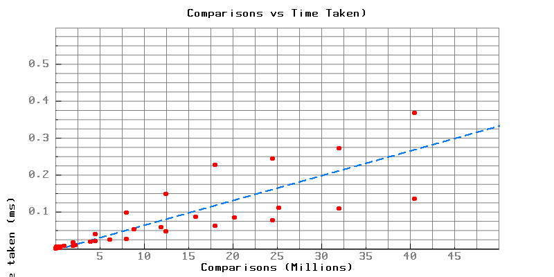
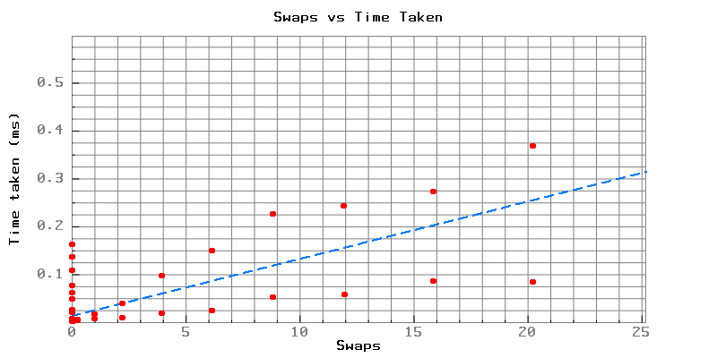

# CT102 - Sorting Algorithms Performance Analysis

## Introduction

This project is a comprehensive study of various sorting algorithms implemented in C. The project reads data from
specific files, applies these sorting algorithms. The project also measures the time taken by each sorting algorithm to
sort the data. The project is implemented in C and uses the time.h library to measure the time taken by each sorting
algorithm and also counts swaps, comparisons, function calls and than writes this data in organised way into .csv file.

The project is structured around several key files and functions, including main.c, SortingOperations.h,
SortingAlgorithms.h, and SortingResult.h. Each of these plays a crucial role in the execution of the sorting operations
and the recording of their results.

The main.c file is where the program execution begins. It includes the main() function and the processFile() function.
The processFile() function reads numbers from an input file, sorts them using different sorting algorithms, and writes
the results to a result file.

The sorting functions are defined in the SortingAlgorithms.h file, and the operations related to sorting and writing
results to a file are defined in the SortingOperations.h file. The SortingResult.h file defines the SortingResult
structure, which holds the results of a sorting operation.

## Gathering Data

### Requirements

The project is designed to process a file containing 10,000 numbers and execute each sorting algorithm 10 times. The
numbers are sorted in increments of 1,000, starting with the first 1,000 numbers, then the first 2,000, and so on, up to
all 10,000 numbers.

This is achieved by calling the `executeSort()` function 10 times for each sorting algorithm in the `processFile()`
function. Each time the function is called, it sorts an increasing number of elements from the array of numbers read
from the file.

The `executeSort()` function takes in the array of numbers, the sorting function to be used, the name of the sorting
algorithm, the index of the array, the `SortingResult` array to store the results, and the file path of the input file.
The index of the array is incremented by 1,000 after each execution of the sorting algorithm, allowing the next 1,000
numbers to be sorted.

The results of each sorting operation, including the name of the sorting algorithm, the number of comparisons, swaps,
function calls made, and the execution time, are stored in the `SortingResult` array. These results are then written to
a .csv file by the `writeResultsToFile()` function.

Therefore, the input file must contain at least 10,000 numbers to ensure that each sorting algorithm can be executed 10
times with an increasing number of elements. If the file contains less than 10,000 numbers, the program will not be able
to execute all sorting operations as expected.

### Data Gathering Process

The data is gathered from the sorting algorithms through the `executeSort()` function, which is called in
the `processFile()` function in `main.c`. This function takes in the array of numbers to be sorted, the sorting function
to be used, the name of the sorting algorithm, the index of the array, the `SortingResult` array to store the results,
and the file path of the input file.

Here's a brief overview of how the data is gathered:

1. The `processFile()` function reads numbers from an input file and stores them in an array.
2. The `executeSort()` function is called for each sorting algorithm. This function sorts the numbers using the provided
   sorting function and stores the results in the `SortingResult` array.
3. The `writeResultsToFile()` function is then called to write the sorting results to a specified file.

The `SortingResult` structure, defined in `SortingResult.h`, holds the results of a sorting operation. It includes the
following fields:

- `algorithmName`: The name of the sorting algorithm used.
- `numComparisons`: The number of comparisons made during the sorting operation.
- `numSwaps`: The number of swaps made during the sorting operation.
- `numFunctionCalls`: The number of function calls made during the sorting operation.
- `executionTime`: The time taken to execute the sorting operation.

These fields correspond to the columns in the .csv file. Each row in the .csv file represents a single sorting
operation, with the columns representing the above fields. The `writeResultsToFile()` function writes these results to
the .csv file in an organized manner.

## Project Structure

The project is organized into several key files:

- `main.c`: This is the main file where the program execution begins. It includes the `main()` function and
  the `processFile()` function.

- `SortingOperations.h`: This file defines the `executeSort()` and `writeResultsToFile()` functions, which are used to
  perform the sorting operations and write the results to a file.

- `SortingAlgorithms.h`: This file defines the sorting functions used in the project,
  including `bubbleSort()`, `selectionSort()`, `insertionSort()`, `countingSort()`, `quickSort()` and `mergeSort()`.

- `SortingResult.h`: This file defines the `SortingResult` structure, which holds the results of a sorting operation.

### Functions

- `processFile()`: This function reads numbers from an input file, sorts them using different sorting algorithms, and
  writes the results to a result file.

- `executeSort()`: This function reads numbers from the file, sorts them using the provided sorting function, and stores
  the results in the `SortingResult` array.

- `writeResultsToFile()`: This function writes the sorting results to the specified file.

### Sorting Algorithms

- `bubbleSort()`
- `selectionSort()`
- `insertionSort()`
- `countingSort()`
- `quickSort()`
- `mergeSort()`

## Adding and Removing Sorting Algorithms

The sorting algorithms used in this project are defined in the `SortingAlgorithms.h` file and are executed in
the `processFile()` function in the `main.c` file.

### Removing a Sorting Algorithm

To remove a sorting algorithm, you need to remove the corresponding `executeSort()` function call in the `processFile()`
function. For example, to remove the Merge Sort algorithm, you would remove this line:

```c
executeSort(numbers, mergeSort, "Merge Sort", &arrIndex, sortingResultsFile, filePath);
```

### Adding a Sorting Algorithm

To add a new sorting algorithm, you need to:

1. Define the sorting function in the `include\SortingAlgorithms.h` file.
2. Implement the sorting function in the `src\SortingAlgorithms.c` file.
3. Add a new `executeSort()` function call in the `processFile()` function that is located in `main.c`, passing the new
   sorting function as an argument. For example, if you've added a Heap Sort function named `heapSort()`, you would add
   this line:

```c
executeSort(numbers, heapSort, "Heap Sort", &arrIndex, sortingResultsFile, filePath);
```

Remember to adjust the **NUM_SORTING_ALGORITHMS** and NUM_RESULTS_PER_ALGORITHM constants as needed when adding or
removing sorting algorithms.

## Prerequisites

Before running this project, you need to ensure that your system meets the following prerequisites:

1. **C Compiler**: The project is implemented in C, so you need a C compiler to compile the source code. GCC (GNU Compiler Collection) is recommended. You can download it from [here](https://gcc.gnu.org/install/index.html).

2. **Text Editor or IDE**: You need a text editor or an Integrated Development Environment (IDE) to view and edit the source code. Examples include Visual Studio Code, Sublime Text, or CLion.

3. **Command Line Interface**: You need a command line interface to compile and run the project. On Windows, you can use Command Prompt or PowerShell. On macOS and Linux, you can use Terminal.

4. **Git**: If you want to clone the project repository from GitHub, you need to have Git installed on your system. You can download it from [here](https://git-scm.com/downloads).

5. **Absolute Paths**: You need to provide absolute paths to the input and output files in the `main.c` file. This is necessary to ensure that the program can read from and write to the specified files.


## Running the Project

1. Clone the repository to your local machine.
2. Go to the project directory.
3. Modify the `main.c` file paths to the input and output files as needed. Your paths need to be a **bsolute paths**.
4. Compile the project using the following command:

```bash
gcc -I ./include -o main main.c ./src/*.c ./plot/*
```

5. Run the compiled program using the following command:

```bash
.\main.exe
```

6. You will find gathered data in .csv file you gave as an output file path.

## Libraries Used

This project uses the following standard C libraries:

1. **stdio.h**: This library is used for input and output operations. It provides functions for reading from and writing to the console and files.

2. **stdlib.h**: This library includes functions involving memory allocation, process control, conversions and others. It's used in this project for dynamic memory allocation for arrays.

3. **time.h**: This library is used for time-related functions. In this project, it's used to measure the execution time of the sorting algorithms.

4. **string.h**: This library is used for manipulating arrays of characters. It's used in this project for string comparison and copying operations.

These libraries are included at the beginning of the relevant source files using the `#include` directive. For example:

```c
#include <stdio.h>
#include <stdlib.h>
#include <time.h>
#include <string.h>
```

No external libraries are used in this project. All functionality is achieved using the standard C libraries.

## Graphs




## Contact Information

For any queries or suggestions, you can reach out to me at:

- GitHub: [Olszewski-Jakub](https://github.com/Olszewski-Jakub)
- Email: j.olszewski05@gmail.com
- LinkedIn: [Jakub Olszewski](https://www.linkedin.com/in/j-olszewski/)
- Portfolio: [Jakub Olszewski - Portfolio](https://jakubolszewski.netlify.app/)

